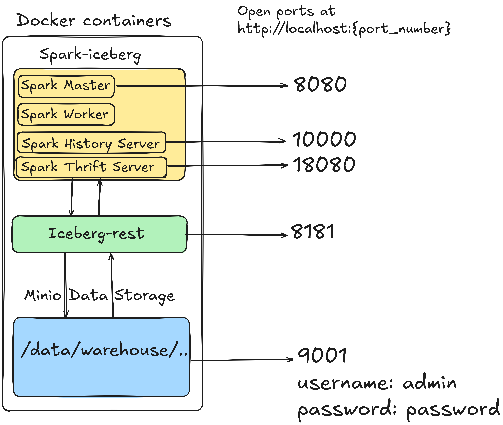

* [How to quickly set up a local Spark development environment?](#how-to-quickly-set-up-a-local-spark-development-environment)
    * [Setup](#setup)
        * [Local](#local)
            * [Prerequisites](#prerequisites)
        * [CodeSpaces](#codespaces)
    * [Features](#features)
    * [Architecture](#architecture)
    * [Spinning down infrastructure](#spinning-down-infrastructure)

# How to quickly set up a local Spark development environment?

Code for post at [How to quickly set up a local Spark development environment?](https://www.startdataengineering.com/post/spark-local-setup/)

The objective of this repo is to provide a simple-to-setup way to run & develop on Spark locally.

## Setup

You can setup this Spark environment either locally (recommended) or on CodeSpaces (GitHub's online development environment).

### Local

To setup this Spark environment locally you'll need.

#### Prerequisites

1. [git version >= 2.37.1](https://github.com/git-guides/install-git)
2. [Docker version >= 20.10.17](https://docs.docker.com/engine/install/) and [Docker compose v2 version >= v2.10.2](https://docs.docker.com/compose/#compose-v2-and-the-new-docker-compose-command).
3. A computer with at least 4GB RAM.
4. [Visual Studio Code](https://code.visualstudio.com/download)

**Windows users**: please setup WSL and a local Ubuntu Virtual machine following **[the instructions here](https://ubuntu.com/tutorials/install-ubuntu-on-wsl2-on-windows-10#1-overview)**. Install the above prerequisites on your ubuntu terminal; if you have trouble installing docker, follow **[the steps here](https://www.digitalocean.com/community/tutorials/how-to-install-and-use-docker-on-ubuntu-22-04#step-1-installing-docker)** (only Step 1 is necessary).

You **`do not need to install anything else directly on your computer`**.

Once you have the pre-requisites, fork this Spark repo as shown below.


Now open a terminal on your computer and in the desired directory clone the repo your forked repo.

```bash
git clone
cd local_spark_setup
```

Open your `local_spark_setup` in Visual Studio Code. Open the file `.devcontainer/devcontainer.json`.

Now click on `view -> Command Palette..` and then type **`Dev Containers: Rebuild and Reopen in Container`**.

Visual Studio Code will start the docker containers, open a Visual Studio Code instance inside of it and then install the extensions. See [devcontainer.json](.devcontainer/devcontainer.json) for details on the series of steps that are executed in this stage.


Your Spark development environment is ready, go to the post at [How to quickly set up a local Spark development environment?](https://www.startdataengineering.com/post/data-modeling-join-groupby/) for details on how to use this environment.

### CodeSpaces

GitHub CodeSpaces are an online development environment that makes it extremely easy to create and run environments for a repo.

Note that there is a [free limit](https://github.com/pricing), which should be sufficient for our use case.

Click on this button to fork this repo and start a codespace environment.

[](https://github.com/codespaces/new?skip_quickstart=true&machine=basicLinux32gb&repo=1040634331&ref=main&devcontainer_path=.devcontainer%2Fdevcontainer.json&geo=UsEast)

**Note** Ensure that the code space environment is shut down after use.

## Features

1. [Running & debugging Spark interactively and as a script](https://www.startdataengineering.com/post/spark-local-setup/#31-run-code-interactively-with-jupyter-notebook)
2. [Using Spark UI to explore how Spark is processing our data](https://www.startdataengineering.com/post/spark-local-setup/#33-explore-spark-performance-with-the-spark-ui)
3. [Viewing Iceberg data in its location and exploring Parquet data with Data Wrangler](https://www.startdataengineering.com/post/spark-local-setup/#34-examine-iceberg-data-with-data-wrangler-local-only)
4. [Overview of how devcontainer sets up our local dev environment](https://www.startdataengineering.com/post/spark-local-setup/#35-devcontainers-make-it-easy-to-set-up-a-local-spark-environment)

## Architecture



We use docker to setup containers to run:

1. Spark: This container named `spark-iceberg` runs Spark Master, Worker, History server and Thrift server.
2. Minio: This container runs a `minio` server, which provides an S3 compatible interface, ie it works as a local S3 equivalent.
3. Iceberg Rest interface: This is a rest server which allows anyone to interact with the Iceberg tables in Minio.

For more information on how docker works, [read this](https://www.startdataengineering.com/post/docker-for-de/).

We use the following official images from DockerHub, instead of creating our own.

1. [Spark-iceberg](https://hub.docker.com/r/tabulario/spark-iceberg)
2. [Minio](https://hub.docker.com/r/minio/minio)
3. [iceberg-rest-fixture](https://hub.docker.com/r/apache/iceberg-rest-fixture)
4. [minio-mc](https://hub.docker.com/r/minio/mc) is a container that creates our minio folders.

## Spinning down infrastructure

Once you are done working with the containers, click on devcontainers icon on the bottom left of your Visual Studio Code and click on close containers.


**Note** Ensure that the code space environment is shut down after use.
